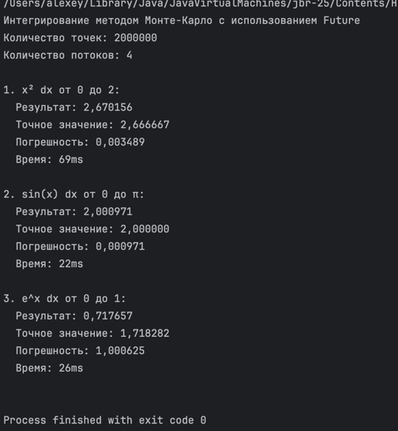

# Отчет по лабораторной работе: Параллельная численная интеграция методом Монте-Карло
## Блошкин Алексей
## 23-ПО-2
##  **Цель работы**
Численное интегрирование монотонной функции методом монте-карло:  
строите прямогольник "накрывающий" нужный отрезок функции и "кидаете" точки в сулчайные места.  
Отношение точек ближе к Ох чем функция и всех точек ~= отношеню площади под графиком функции и всей площади прямоугольника.

## ️ **Архитектура (1 файл)**
MonteCarloIntegration/  
└── MonteCarloIntegration.scala

## **Алгоритм Монте-Карло**

### **1. Поиск ограничивающего прямоугольника**
(я не разобрался как вставлять ссылки)  
val (minVal, maxVal) = (0 to 1000).foldLeft((Double.MaxValue, Double.MinValue)) {  
// Находим min/max функции на [l, r]  
}  
val height = maxVal - minVal // Высота прямоугольника  

### **2. Параллельное распределение точек**
val futures = (0 until threadsNumber).map { taskId =>  
Future { // Каждый поток — свой Future  
// Генерирует pointsPerTask случайных точек  
// Считает попадания под график  
}  
}  

### **3. Агрегация результатов**
val totalSuccessFuture = Future.foldLeft(futures)(0L)(_ + _) // Суммируем все Future  
val ratio = totalSuccess.toDouble / pointsNumber // Доля попаданий  
val integral = rectangleArea * ratio // Площадь  

## ️ **Параллелизация**

| Поток | Задача | Точки |
|-------|--------|-------|
| **0** | Подграфик 1 | 500,000 |
| **1** | Подграфик 2 | 500,000 |
| **2** | Подграфик 3 | 500,000 |
| **3** | Подграфик 4 | 500,000 |

**ExecutionContext**: `Executors.newFixedThreadPool(threadsNumber)`

##  **Тестирование (3 функции)**

| Функция | Интервал | Точное значение | Точки | Потоки |
|---------|----------|-----------------|-------|--------|
| **x²** | [0, 2] | **2.666667** | 2M | 4 |
| **sin(x)** | [0, π] | **2.000000** | 2M | 4 |
| **eˣ** | [0, 1] | **1.718282** | 2M | 4 |

## **Пример вывода**
  

##  **Ключевые технологии**

| Концепция | Реализация |
|-----------|------------|
| **Future** | `Future { ... }` — асинхронные задачи |
| **ExecutionContext** | `Executors.newFixedThreadPool(4)` — пул потоков |
| **Future.foldLeft** | Агрегация результатов параллельных вычислений |
| **Await.result** | Синхронизация (ожидание завершения) |
| **Random** | Генератор случайных точек |

